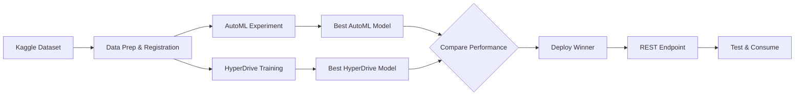

# Azure ML Capstone Project

## Project Overview

This project demonstrates the ability to use Azure Machine Learning to solve a real-world classification problem. The workflow includes:
- Ingesting an external dataset from Kaggle
- Training two models: AutoML and custom model with HyperDrive hyperparameter tuning
- Comparing model performance and selecting the best performer
- Deploying the best model as a web service endpoint
- Testing endpoint with real inference requests

**Dataset**: Heart Failure Prediction from Kaggle
**Problem**: Binary classification - predict patient survival based on clinical metrics
**Models**: AutoML classifier vs. HyperDrive-tuned logistic regression

## Project Architecture



## Repository Structure

```
Azure_ML_Capstone_project/
├── README.md
├── QUICK_REFERENCE.md                # Quick lookup guide
├── RESOURCE_TRACKING.md              # Session management template
├── RUBRIC_ASSESSMENT.md              # Rubric compliance analysis
├── CAPSTONE_SCAFFOLD_VALIDATION.md   # Component inventory
├── requirements.txt
├── .gitignore
├── .env.capstone.example
├── config/
│   └── aml_config.capstone.example.json
├── data/
│   ├── README.md                     # Sample data documentation
│   ├── test_samples.json             # Example endpoint requests
│   └── heart_failure.csv             # Kaggle dataset (download required)
├── src/
│   ├── __init__.py
│   ├── aml_utils.py                  # Azure ML workspace utilities
│   ├── data_prep.py                  # Dataset ingestion & registration
│   ├── automl_run.py                 # AutoML experiment
│   ├── hyperdrive_run.py             # HyperDrive configuration
│   ├── train_hyperdrive.py           # HyperDrive training script
│   ├── compare_models.py             # Model comparison
│   ├── score.py                      # Inference/scoring script
│   ├── deploy.py                     # Model deployment
│   └── consume.py                    # Endpoint consumption test
├── notebooks/
│   └── capstone_rubric_validation.ipynb  # Automated rubric validator
├── artifacts/
│   ├── data_prep.json
│   ├── automl_results.json
│   ├── hyperdrive_results.json
│   ├── comparison_results.json
│   ├── deployment_details.json
│   ├── consume_results.json
│   └── rubric_compliance_report.json
└── screenshots/
    └── (7+ required images)
```

## Udacity Lab Constraints & Best Practices

⚠️ **CRITICAL**: This capstone uses a sandboxed Udacity cloud lab environment with strict resource limits.

### Session & Attempt Limits
- **Limited session duration**: Your cloud lab session will expire automatically
- **10 total attempts allowed**: Each new session counts as an attempt
- **No persistence across sessions**: Resources are not preserved when session expires
- Exhausting all 10 attempts requires contacting udacity-labsupport@udacity.com

### Resource Management Rules
- **Always delete resources when not in use**
- **Use lightweight compute instances only** (see table below)
- Misuse can result in revoking lab access or account deactivation
- Udacity monitors lab usage for educational compliance

### Recommended Compute SKUs

| Load Type | VM Size | vCPU | Memory | Storage |
|-----------|---------|------|--------|---------|
| Light | Standard_DS1_v2 | 1 core | 3.5 GB | 7 GB |
| Medium | Standard_DS2_v2 | 2 cores | 7 GB | 14 GB |
| Medium | Standard_D2s_v3 | 2 cores | 8 GB | 16 GB |
| Heavy | Standard_DS3_v2 | 4 cores | 14 GB | 28 GB |

**⚠️ Recommendation for Capstone**: Use `Standard_DS1_v2` (1 core) for compute instance and `Standard_D2s_v3` (2 cores) for compute cluster to avoid quota exhaustion.

### Session Planning

1. **Before starting** - Ensure you understand all steps and have dataset ready
2. **During execution** - Minimize time between steps to avoid session timeout
3. **After completion** - Delete all resources immediately:
   - Compute instances
   - Compute clusters
   - ACI endpoints
   - Storage accounts
   - Other non-essential resources

4. **Checkpoints** - Save artifacts locally after each major step:
   - automl_results.json
   - hyperdrive_results.json
   - comparison_results.json
   - deployment_details.json

## Sample Data & Testing

See [data/README.md](data/README.md) for comprehensive documentation on:
- **Heart Failure dataset**: Clinical features and their medical meanings
- **Sample request format**: JSON array structure expected by the endpoint
- **Feature specifications**: 12 clinical metrics with ranges and descriptions
- **Response format**: Prediction + class probabilities returned by endpoint
- **Realistic examples**: Low-risk and high-risk patient profiles
- **Testing strategies**: Single vs. batch predictions, edge cases, confidence levels
- **Error handling**: Common issues and how to resolve them

Quick example:
```bash
# Test deployed endpoint with sample data
python src/consume.py --config config/aml_config.capstone.json --endpoint-name capstone-endpoint --test-data data/test_samples.json
```

### Sample Data Format

The endpoint expects feature arrays in this format:
```json
{
  "data": [
    [63, 0, 0, 380, 0, 1, 0, 1, 0, 0, 0, 0]
  ]
}
```

Where the 12 values represent (in order):
1. age, 2. anaemia, 3. creatinine_phosphokinase, 4. ejection_fraction, 5. high_blood_pressure, 6. platelets, 7. serum_creatinine, 8. serum_sodium, 9. sex, 10. smoking, 11. time, 12. diabetes

## Setup

### Python Version
- Requires Python 3.8-3.11 (Azure ML SDK v1 compatibility)

### Installation

```powershell
py -3.11 -m venv .venv
.\.venv\Scripts\python.exe -m pip install --upgrade pip
.\.venv\Scripts\python.exe -m pip install -r requirements.txt
```

### Configuration

1. Copy template config:
   ```powershell
   Copy-Item config/aml_config.capstone.example.json config/aml_config.capstone.json
   ```

2. Update with your workspace details:
   - subscription_id
   - resource_group
   - workspace_name

3. Set environment variables (create `.env.capstone` from `.env.capstone.example`)

## Execution Workflow

### 1. Prepare Data
```bash
python src/data_prep.py --config config/aml_config.capstone.json --input-data data/heart_failure.csv --dataset-name heart-failure-capstone
```
- Downloads external dataset from Kaggle
- Preprocesses and registers in Azure ML workspace
- Splits into train/test sets

**Outputs**: `artifacts/data_prep.json`

### 2. AutoML Training
```bash
python src/automl_run.py --config config/aml_config.capstone.json --compute-target capstone-compute --experiment-name capstone-automl --timeout-minutes 60
```
- Trains multiple classification models automatically
- Tracks best run and model performance
- Registers best model

**Outputs**: `artifacts/automl_results.json`

### 3. HyperDrive Training
```bash
python src/hyperdrive_run.py --config config/aml_config.capstone.json --compute-target capstone-compute --experiment-name capstone-hyperdrive
```
- Trains custom logistic regression model
- Tunes hyperparameters (C, solver, max_iter) with grid sampling
- Tracks best run and hyperparameters

**Outputs**: `artifacts/hyperdrive_results.json`

### 4. Model Comparison
```bash
python src/compare_models.py
```
- Compares AutoML and HyperDrive model performance
- Selects best model based on accuracy
- Documents decision rationale

**Outputs**: `artifacts/comparison_results.json`

### 5. Deploy Best Model
```bash
python src/deploy.py --config config/aml_config.capstone.json --model-name <best-model-name> --endpoint-name capstone-endpoint
```
- Packages best model with scoring script
- Deploys to ACI endpoint
- Enables App Insights logging

**Outputs**: `artifacts/deployment_details.json`

### 6. Test Endpoint
```bash
python src/consume.py --config config/aml_config.capstone.json --endpoint-name capstone-endpoint --test-data data/test_samples.json
```
- Sends test requests to deployed endpoint
- Validates inference response
- Measures response time

**Outputs**: `artifacts/consume_results.json`

## Project Results (To be filled during execution)

### Dataset Summary
- **Source**: Kaggle - Heart Failure Prediction
- **Records**: ~299 samples
- **Features**: 12 clinical metrics
- **Target**: DEATH_EVENT (binary: 0=survived, 1=deceased)

### Model Performance

#### AutoML Results
- **Algorithm**: [Best algorithm selected by AutoML]
- **Accuracy**: [To be measured]
- **AUC**: [To be measured]

#### HyperDrive Results
- **Algorithm**: Logistic Regression
- **Best Hyperparameters**: [To be found during tuning]
- **Accuracy**: [To be measured]
- **AUC**: [To be measured]

#### Comparison & Winner
- **Best Model**: [To be determined]
- **Winning Accuracy**: [To be measured]
- **Deployment Model**: [Winner model name]

## Deployment Details

### Endpoint Configuration
- **Service**: Azure Container Instance (ACI)
- **Auth**: Key-based authentication
- **App Insights**: Enabled for monitoring
- **Endpoint URL**: [To be added after deployment]

### Inference Test
- **Input**: JSON array of feature vectors
- **Output**: Predicted class and probability
- **Response Time**: [To be measured]

## Screenshots & Demonstration

### Required Evidence
1. Dataset registered in Azure ML Studio
2. AutoML experiment completed
3. HyperDrive run completed with best hyperparameters
4. Model comparison results showing winner
5. Endpoint deployment with App Insights enabled
6. Successful endpoint inference request/response
7. Endpoint test output showing predictions

### Video Demonstration
- Screencast link: [To be added]
- Duration: 1-5 minutes
- Quality: 1080p, 16:9 aspect ratio, clear audio

## Technologies Used

- **Azure ML SDK v1**: Model training and deployment
- **AutoML API**: Automated model selection
- **HyperDrive API**: Hyperparameter optimization
- **Azure Container Instance**: Model deployment
- **Application Insights**: Performance monitoring

## Resource Cleanup (Before Session Expires)

⚠️ **CRITICAL**: Delete all resources to stay within quota and preserve attempts.

### Cleanup Checklist

```bash
# Via Azure Portal or CLI:
az ml compute list --resource-group <RG> --workspace-name <WS>
az ml compute delete --name capstone-compute --resource-group <RG> --workspace-name <WS>

# Delete ACI endpoint:
az ml online-deployment delete --name capstone-endpoint-deploy --endpoint-name capstone-endpoint

# Delete compute instance:
az ml compute delete --name <instance-name> --resource-group <RG> --workspace-name <WS>

# Verify cleanup:
az ml compute list --resource-group <RG> --workspace-name <WS> --query length(@)
```

### What to Keep
- Workspace (needed for submission verification)
- Registered dataset (needed for proof)
- Registered models (needed for proof)
- Artifacts in artifacts/ folder (JSON files)

### What to Delete
- Compute clusters (capstone-compute)
- Compute instances
- ACI endpoints
- Temporary storage

## Future Enhancements

- Cross-validation for robust evaluation
- Data drift monitoring post-deployment
- Automated retraining pipeline
- SHAP explainability analysis
- Ensemble methods comparison

## Support

For lab issues, contact: [udacity-labsupport@udacity.com](mailto:udacity-labsupport@udacity.com)

## Submission Checklist

- [x] Project folder with separation from Ops project
- [ ] Read Udacity lab constraints and resource SKU recommendations
- [ ] Data preparation and registration
- [ ] AutoML training and best model
- [ ] HyperDrive training with hyperparameters
- [ ] Model comparison and winner selection
- [ ] Model deployment with App Insights
- [ ] Endpoint consumption and test
- [ ] Screenshots of all steps
- [ ] Video demonstration
- [ ] Artifacts saved locally (JSON files backed up)
- [ ] **All resources deleted from Azure ML Studio** ⚠️
- [ ] Final README with all results
- [ ] Git commit and push (if using version control)
