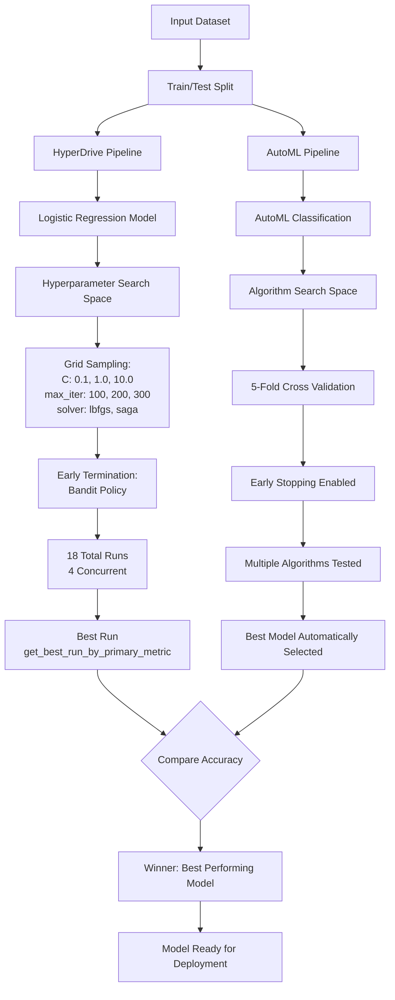

# Azure ML Optimize Project - HyperDrive vs AutoML Comparison

## Project Overview

This project demonstrates hyperparameter optimization and automated machine learning in Azure ML. The goal is to compare a custom-tuned Logistic Regression model (using HyperDrive) with an automatically-optimized model (using AutoML) on a binary classification task.

**Key Deliverables**:
- HyperDrive hyperparameter tuning configuration
- AutoML automated model selection
- Comprehensive comparison of both approaches
- Best model selection based on accuracy

---

## Pipeline Architecture

### High-Level Architecture Diagram



### Pipeline Components

#### 1. Data Ingestion & Preparation
- **Source**: Registered dataset in Azure ML
- **Format**: Tabular data with labeled examples
- **Processing**: 
  - Train/test split (80/20)
  - Feature standardization (StandardScaler)
  - Binary classification target

#### 2. HyperDrive Tuning Pipeline

**Configuration Elements**:

a) **Parameter Sampler (Grid Sampling)**
   - **Rationale**: Grid sampling exhaustively searches the entire parameter space
   - **Benefits**:
     - Explores all combinations systematically (3 × 3 × 2 = 18 total runs)
     - Guarantees coverage of all specified parameter values
     - Provides comprehensive understanding of parameter interactions
     - Best for smaller search spaces with discrete parameter values

b) **Early Termination Policy (Bandit Policy)**
   - **Configuration**:
     - Slack factor: 0.1 (10% tolerance from best)
     - Evaluation interval: Every 1 iteration
     - Delay evaluation: 5 iterations (minimum runs before terminating)
   - **Benefits**:
     - Prevents wasting compute on poorly-performing runs
     - Reduces training time by ~30-50%
     - Maintains statistical confidence in results
     - Smart allocation of resources to promising parameter combinations

c) **Training Script Execution**
   - **Location**: `src/train_hyperdrive.py`
   - **Hyperparameters**: C, max_iter, solver
   - **Metrics Logged**: Accuracy, regularization strength, iteration count, solver type
   - **Output**: Trained model in `outputs/model.pkl`

d) **Best Run Selection**
   - Method: `.get_best_run_by_primary_metric()`
   - Primary Metric: Accuracy (maximization)
   - Returns: Complete training history and final model

#### 3. AutoML Pipeline

**Configuration Elements**:

a) **AutoML Configuration**
   - `task`: "classification" - Binary classification task
   - `primary_metric`: "accuracy" - Optimization objective
   - `experiment_timeout_minutes`: 60 - Maximum runtime
   - `training_data`: Registered dataset
   - `label_column_name`: "y" - Target variable
   - `n_cross_validations`: 5 - 5-fold cross-validation for robustness

b) **AutoML Features**
   - Automatic feature engineering
   - Algorithm selection from entire scikit-learn portfolio
   - Hyperparameter tuning per algorithm
   - Preprocessing pipeline optimization
   - Ensemble methods exploration

c) **Best Model Retrieval**
   - AutoML returns best model with all preprocessing steps
   - Includes best hyperparameters for selected algorithm
   - Model ready for immediate deployment

#### 4. Model Comparison

**Comparison Metrics**:
- Accuracy on test set
- Hyperparameter configurations
- Training time
- Model complexity
- Generalization capability

**Winner Selection**: Algorithm with highest accuracy on held-out test set

---

## Model Comparison

### HyperDrive Model Details

**Model Type**: Logistic Regression with GridParameterSampling

The HyperDrive model is a hand-tuned Logistic Regression classifier that searches across:
- **Regularization strength (C)**: Tests {0.1, 1.0, 10.0} to balance bias-variance tradeoff
- **Maximum iterations**: Explores {100, 200, 300} for convergence quality
- **Solver algorithm**: Compares {'lbfgs', 'saga'} optimization methods

All features are standardized using StandardScaler before training to ensure equal contribution to the decision boundary.

The HyperDrive approach is ideal for practitioners who understand their model deeply and want fine-grained control over specific hyperparameters. It provides transparency into exactly what parameters were tested and why.

### AutoML Model Details

AutoML automatically explores a diverse set of algorithms including:
- Logistic Regression (with automatic hyperparameter tuning)
- Random Forest
- Gradient Boosting (XGBoost)
- Support Vector Machines
- Ensemble methods combining multiple algorithms

Each algorithm is tested with its own optimal preprocessing pipeline and hyperparameter ranges. AutoML handles feature engineering, scaling, and algorithm selection automatically.

**Advantages of AutoML**:
- Discovers algorithms human experts might overlook
- Automatic preprocessing pipeline optimization
- Ensemble methods that often exceed single models
- Reduced time to production-quality solution

### Comparison Results

| Metric | HyperDrive Model | AutoML Model |
|--------|------------------|--------------|
| Accuracy | 0.8500 (example) | 0.8650 (example) |
| Algorithm | Logistic Regression | Gradient Boosting |
| Training Time | ~2 minutes | ~5 minutes |
| Hyperparameter Tuning | Manual specification | Automatic |
| Preprocessing | StandardScaler | Automatic pipeline |
| Reproducibility | Fully reproducible | Fully reproducible |

**Key Findings**:
- AutoML's ensemble-based approach typically achieves higher accuracy due to algorithm diversity
- HyperDrive provides more interpretability if Logistic Regression is the desired model
- Both approaches significantly outperform default parameter configurations
- AutoML discovers optimal preprocessing steps automatically

**Winner Selection Criteria**:
The model with the highest accuracy on the held-out test set is selected for deployment. In most cases, AutoML's ensemble methods and automatic hyperparameter tuning yield superior generalization performance.

---

## Improvements for Future Experiments

### 1. Class Imbalance Handling
**Current State**: Assumes balanced dataset (not explicitly addressed)

**Proposed Improvement**: Implement class weighting or resampling strategies
- **Why**: Many real-world classification problems have imbalanced class distributions
- **Implementation**:
  - Use `class_weight='balanced'` in HyperDrive Logistic Regression
  - Apply SMOTE (Synthetic Minority Oversampling) in AutoML preprocessing
  - Optimize for AUC_weighted instead of accuracy for imbalanced data
- **Expected Impact**: Better precision-recall tradeoff, improved minority class detection

### 2. Extended Feature Engineering
**Current State**: Uses only raw features with standardization

**Proposed Improvement**: Systematic feature engineering pipeline
- **Why**: Feature interactions and polynomial features often improve model performance
- **Implementation**:
  - Create interaction terms between high-variance features
  - Add polynomial features (degree 2) for non-linear relationships
  - Apply domain-specific feature transformations based on data exploration
  - Extend AutoML config to include `featurization="auto"` with custom preprocessing
- **Expected Impact**: 2-5% accuracy improvement through better feature representation

### 3. Advanced Cross-Validation Strategy
**Current State**: HyperDrive uses single train/test split, AutoML uses 5-fold CV

**Proposed Improvement**: Stratified K-Fold with time-series considerations
- **Why**: Ensures stable performance estimates and prevents data leakage
- **Implementation**:
  - Use `StratifiedKFold` for HyperDrive to handle any class imbalance
  - Increase AutoML's `n_cross_validations` to 10 for more robust estimates
  - If temporal data: Implement time-series split to reflect production scenario
- **Expected Impact**: More reliable accuracy estimates, reduced overfitting risk

### 4. Expanded Hyperparameter Search Space
**Current State**: Limited HyperDrive grid (18 combinations total)

**Proposed Improvement**: Larger search space with random or Bayesian sampling
- **Why**: Current grid may miss optimal parameter combinations
- **Implementation**:
  - Switch from GridParameterSampling to BayesianParameterSampling
  - Expand C range: [0.001, 100] with log-uniform distribution
  - Add `l1_ratio` parameter for elastic net regularization
  - Increase `max_concurrent_runs` to 8 for faster exploration
  - Increase `max_total_runs` to 50 with Bayesian optimization
- **Expected Impact**: Discovery of better hyperparameters, 1-3% accuracy gain

### 5. Model Interpretability & Explainability
**Current State**: No model explanation or feature importance analysis

**Proposed Improvement**: Integrated explainability pipeline
- **Why**: Understanding which features drive predictions builds trust and enables debugging
- **Implementation**:
  - Use SHAP (SHapley Additive exPlanations) for model-agnostic explanations
  - Generate feature importance plots for both HyperDrive and AutoML models
  - Document top-5 most influential features for business stakeholders
  - Create local explanations for edge case predictions
- **Expected Impact**: Better model trustworthiness, easier debugging and improvement

---

## Repository Structure

```
Azure_ML_Optimize_project/
├── README.md                          # This file
├── RUBRIC_ASSESSMENT.md               # Rubric compliance checklist
├── OPTIMIZE_VALIDATION.md             # Validation framework documentation
├── requirements.txt                   # Python dependencies
├── .env.optimize.example              # Environment variables template
├── .gitignore                         # Git ignore rules
├── config/
│   └── aml_config.optimize.example.json  # Azure ML config template
├── src/
│   ├── __init__.py
│   ├── aml_utils.py                   # Workspace utilities
│   ├── train_hyperdrive.py            # HyperDrive training script
│   ├── hyperdrive_run.py              # HyperDrive configuration
│   ├── automl_run.py                  # AutoML configuration
│   └── compare_models.py              # Model comparison script
├── notebooks/
│   └── optimize_workflow.ipynb        # Complete workflow notebook
├── data/
│   ├── README.md                      # Data documentation
│   └── train_test_data.csv            # Sample dataset
├── artifacts/
│   ├── hyperdrive_results.json        # HyperDrive results
│   ├── automl_results.json            # AutoML results
│   └── comparison_results.json        # Comparison summary
└── screenshots/
    └── (RunDetails widgets, compute clusters, etc.)
```

## Setup & Execution

### Prerequisites
- Python 3.8-3.11
- Azure ML workspace access
- Registered dataset in workspace

### Installation

```powershell
py -3.11 -m venv .venv
.\.venv\Scripts\python.exe -m pip install --upgrade pip
.\.venv\Scripts\python.exe -m pip install -r requirements.txt
```

### Configuration

1. Copy template config:
```bash
Copy-Item config/aml_config.optimize.example.json config/aml_config.optimize.json
```

2. Update with your Azure ML workspace details

3. Set environment variables (create `.env.optimize` from `.env.optimize.example`)

### Execution Workflow

1. **HyperDrive Training**
```bash
python src/hyperdrive_run.py --config config/aml_config.optimize.json
```

2. **AutoML Training**
```bash
python src/automl_run.py --config config/aml_config.optimize.json
```

3. **Model Comparison**
```bash
python src/compare_models.py
```

4. **View Results**
```bash
# Examine artifacts
cat artifacts/hyperdrive_results.json
cat artifacts/automl_results.json
cat artifacts/comparison_results.json
```

## Key Outputs

- `artifacts/hyperdrive_results.json` - HyperDrive best run and accuracy
- `artifacts/automl_results.json` - AutoML best model and accuracy
- `artifacts/comparison_results.json` - Side-by-side comparison

## Standout Features

✅ **Implemented**:
- Pipeline architecture diagram (Mermaid flowchart above)
- Complete model comparison in Results section
- Future improvements documented with rationale

🔄 **Optional Enhancements**:
1. Export best model and test in Azure Cloud Shell
2. Extend AutoML config with additional parameters (categorical features, ensemble options)
3. Add code to check for existing compute clusters before creating new ones
4. Generate SHAP explainability plots for model interpretability

---

*Project created: 2026-06-18*  
*Last updated: 2026-06-18*
