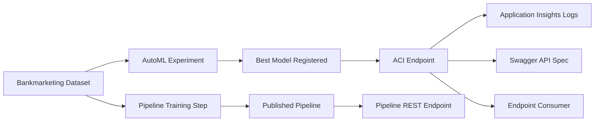

# Azure ML Operationalization Project (Udacity Rubric Ready)

## Project Overview
This project demonstrates an end-to-end Azure Machine Learning MLOps workflow for the Bank Marketing dataset, from AutoML training through deployment, endpoint consumption, and pipeline publishing.

Scope covered:
- Create and run an AutoML experiment.
- Register and deploy the best model as a web service.
- Enable endpoint logging and validate App Insights.
- Generate and review Swagger API documentation.
- Consume the endpoint with JSON payloads.
- Create and publish a reusable ML pipeline and pipeline endpoint.

Dataset:
- https://automlsamplenotebookdata.blob.core.windows.net/automl-sample-notebook-data/bankmarketing_train.csv

## Architectural Diagram



## Repository Structure
- [README.md](README.md)
- [requirements.txt](requirements.txt)
- [LAB_CHECKLIST.md](LAB_CHECKLIST.md)
- [docs/UDACITY_LOGGING_SWAGGER_DOCS.md](docs/UDACITY_LOGGING_SWAGGER_DOCS.md)
- [sample_data/sample_request.json](sample_data/sample_request.json)
- [src/aml_utils.py](src/aml_utils.py)
- [src/automl_experiment.py](src/automl_experiment.py)
- [src/deploy_best_model.py](src/deploy_best_model.py)
- [src/enable_logging.py](src/enable_logging.py)
- [src/get_swagger.py](src/get_swagger.py)
- [src/consume_endpoint.py](src/consume_endpoint.py)
- [src/publish_pipeline.py](src/publish_pipeline.py)
- [src/train_pipeline_model.py](src/train_pipeline_model.py)
- [starter_files/aml-pipelines-with-automated-machine-learning-step.ipynb](starter_files/aml-pipelines-with-automated-machine-learning-step.ipynb)
- [starter_files/endpoint.py](starter_files/endpoint.py)
- [starter_files/logs.py](starter_files/logs.py)
- [starter_files/swagger/serve.py](starter_files/swagger/serve.py)
- [starter_files/swagger/swagger.sh](starter_files/swagger/swagger.sh)

## Setup
Python requirement:
- Azure ML SDK v1 requires Python 3.8-3.11.

Install:

```powershell
py -3.11 -m venv .venv
.\.venv\Scripts\python.exe -m pip install --upgrade pip
.\.venv\Scripts\python.exe -m pip install -r requirements.txt
```

## Execution Steps

1. AutoML experiment
```bash
python src/automl_experiment.py --compute-target cpu-cluster --experiment-name bankmarketing-automl --dataset-name Bankmarketing --model-name bankmarketing-automl-model
```

2. Deploy best model
```bash
python src/deploy_best_model.py --model-name bankmarketing-automl-model --service-name bankmarketing-service
```

3. Enable logging
```bash
python src/enable_logging.py --service-name bankmarketing-service
```

4. Export Swagger
```bash
python src/get_swagger.py --service-name bankmarketing-service
```

5. Consume endpoint
```bash
python src/consume_endpoint.py --service-name bankmarketing-service --input-json sample_data/sample_request.json
```

6. Create and publish pipeline
```bash
python src/publish_pipeline.py --pipeline-experiment-name pipeline-rest-endpoint --pipeline-name bankmarketing-training-pipeline --pipeline-endpoint-name bankmarketing-pipeline-endpoint --compute-name cpu-cluster --dataset-name Bankmarketing
```

## Key Outputs
- artifacts/best_run.json
- artifacts/service_details.json
- artifacts/service_logs.txt
- artifacts/service_logging_status.json
- artifacts/swagger.json
- artifacts/swagger_details.json
- artifacts/published_pipeline.json

## Required Screenshots (Exact Placeholders)

### A. AutoML and Dataset
1. Registered datasets page showing Bankmarketing dataset
- Placeholder: screenshots/01_registered_dataset_bankmarketing.png
- Caption: Bankmarketing dataset is registered and available in Azure ML Studio.

2. AutoML experiment completed
- Placeholder: screenshots/02_automl_experiment_completed.png
- Caption: AutoML experiment status is Completed with best model identified.

### B. Deployment, Logging, and Endpoint Consumption
3. Endpoint overview with App Insights enabled true
- Placeholder: screenshots/03_endpoint_appinsights_true.png
- Caption: Endpoint details show Application Insights enabled equals true.

4. logs.py (or equivalent logging script) execution success
- Placeholder: screenshots/04_logging_script_output.png
- Caption: Logging command completed and logs were retrieved.

5. Swagger running on localhost with methods/responses
- Placeholder: screenshots/05_swagger_localhost.png
- Caption: Swagger UI shows scoring API schema and response model.

6. endpoint.py (or equivalent consumer) returns JSON output
- Placeholder: screenshots/06_endpoint_json_output.png
- Caption: Endpoint invocation succeeds and returns JSON predictions.

7. Apache benchmark optional result
- Placeholder: screenshots/07_apache_benchmark_optional.png
- Caption: Optional load test output from Apache Benchmark.

### C. Pipeline and REST Endpoint
8. Pipeline created with Bankmarketing dataset and AutoML-related flow
- Placeholder: screenshots/08_pipeline_created.png
- Caption: Pipeline graph is visible with dataset and training flow.

9. Published pipeline overview showing REST endpoint and ACTIVE state
- Placeholder: screenshots/09_published_pipeline_active.png
- Caption: Published pipeline endpoint is active and callable.

10. Notebook showing RunDetails widget and step runs
- Placeholder: screenshots/10_notebook_rundetails_widget.png
- Caption: Notebook displays RunDetails widget with step run status.

11. Experiments view showing Completed pipeline run status
- Placeholder: screenshots/11_pipeline_completed_status.png
- Caption: Pipeline run appears under Experiments with Completed status.

12. Experiments view showing Scheduled pipeline run status
- Placeholder: screenshots/12_pipeline_scheduled_status.png
- Caption: Scheduled pipeline run appears under Experiments with Scheduled status.

## Screencast
- Screencast URL: REPLACE_WITH_YOUTUBE_OR_STREAMING_LINK
- Target length: 1 to 5 minutes.
- Quality target: 1080p or higher, 16:9, readable text, clear audio.

Screencast demonstration checklist:
- Working deployed endpoint.
- Available AutoML model.
- Successful JSON request to endpoint.
- Deployed and published pipeline endpoint.

## Optional Written Narration Script (If No Audio)
Paste your narration script below if you submit video without audio:

1. I start by showing the Bankmarketing dataset and completed AutoML experiment.
2. I show the deployed endpoint with App Insights enabled.
3. I run logging and show collected logs.
4. I open Swagger and demonstrate scoring API schema.
5. I call the endpoint with JSON payload and show predictions.
6. I show pipeline creation, published endpoint status, completed run, and scheduled run.

## Future Improvements (Performance and Reliability)
- Add canary deployments and rollback strategy for endpoint updates.
- Introduce data drift and concept drift monitoring with alerting.
- Add model retraining automation and CI/CD quality gates.
- Apply load testing baselines and autoscaling policy tuning.
- Add feature engineering and model selection optimization for higher AUC.

## Standout Suggestions (Optional)
- Add Apache Benchmark results and interpretation.
- Add a parallel run step for batch-style workloads.
- Test a local container with downloaded model.
- Export and validate ONNX model for interoperability.
